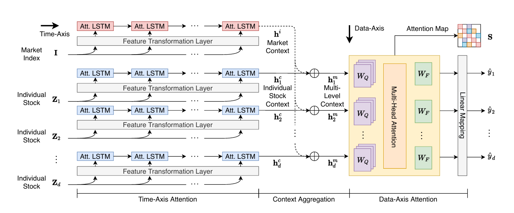
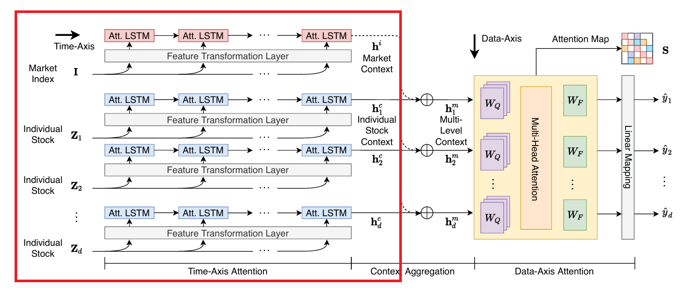
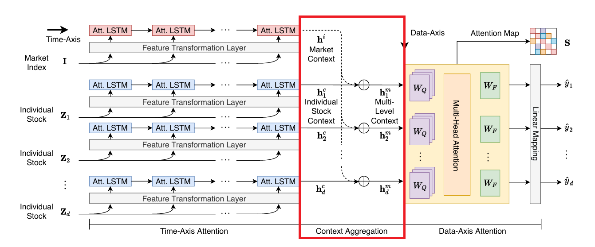
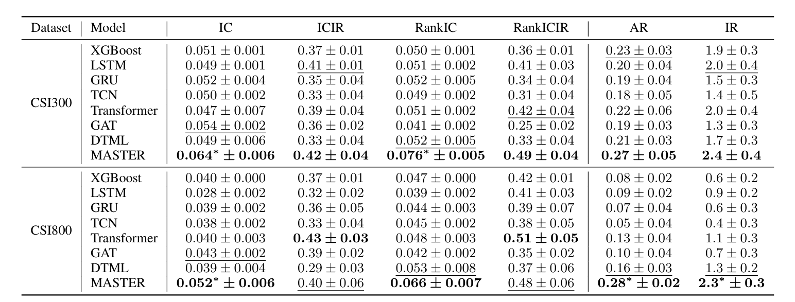
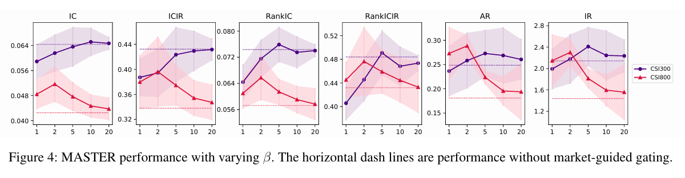

<!-- _paginate: tfalse -->

##    MASTER:Market-Guided Stock Transformer for Stock Price Forecasting
Tong Li, Zhaoyang Liu, Yanyan Shen, Xue Wang, Haokun Chen, Sen Huang
AAAI-24

---
### Outline
* **Introduction**
* **Method**
* **Experienment**

---
### Introduction - Importance of Stock Correlation
Factors influencing stock prices are diverse. Predictions requires:
1. Stock-specific time series
2. Inter-stock correlation
3. Market influence on individual stocks

These correlations are dynamic
→ cannot rely on predefined rules
→ use transformer models

---
### Main Problem 
This study aims to model two phenomena:
1. Momentary and cross-time stock correlations
2. Market status' impact on feature selection

Both issues are limitations identified in Yoo et al. (KDD 2021).

---
### Related Work – Yoo et al., KDD 2021
**Paper:** Accurate Multivariate Stock Movement Prediction via Data-Axis Transformer with Multi-Level Contexts

---
### Related Work (Cont.)
**Part 1: Time Axis Attention**
Single stock time series → Attention LSTM → Summarized embedding

---
### Related Work (Cont.)
**Part 2: Content Aggregation**
Incorporates market and stock representations:  $h^m_u = h^c_u + \beta h^i$

---
### Related Work (Cont.)
**Part 3: Data Axis Attention**
Uses Multihead attention to learn inter-stock correlation.

---
###  Limitation 1 - Cross-time Stock Correlation
**Cause:** Step 1 and 3
Uses overall stock representation to learn cross-stock correlation.

---
###  Limitation 1 - Cross-time Stock Correlation
**Definition:** Dominant factors change over time

**Example:** A raw material shortage
affects upstream stocks first → then affects downstream stocks

---
###  Limitation 2 - Market Status and Feature Selection
**Cause:** Step 2
Integrates market information directly into stock representations.

---
###  Limitation 2 - Market Status and Feature Selection
**Definition:** Market cause features to become relevant or irrelevant.

**Example: bull market → cross-stock features is more relevant**
Bullish markets: investors are optimistic and capital is abundant
→ Investors buy not only a few leading stocks but also broadly across sectors.
→ Stock correlations tend to increase.

---
### Method

---
### Market-Guided Gating

---
### Market-Guided Gating
Given the market status vector $m_{\tau}$, 
learn the scale factor  $\alpha(m_{\tau}) = F \cdot \text{softmax}_{\beta}(W_{\alpha} m_{\tau} + b_{\alpha})$  
to rescale the stock features such that $\tilde{x}_{u,t} = \alpha(m_{\tau}) \circ x_{u,t}$

Market status vector $m_{\tau}$: 
1. Market index price (current value, historical mean, std dev)
2. Market index trading volume

Temperature $\beta$: The smaller the $\beta$, the stronger the gating effect.

---
### Intra-Stock Aggregation

---
### Intra-Stock Aggregation
Single stock behavior is continuous → a simpler distribution

* Input Embedding: $y_{u,t} = f(\tilde{x}_{u,t}),　|y_{u,t}| = D$
* Sinusoidal Positional Encoding:  $p_t$, the order in the window
* Concatenate and Normalize:$Y_u = \big\|_{t \in [1,\tau]} \text{LN}(f(\tilde{x}_{u,t}) + p_t)$
* Multi-Head Attention:

  $Q^1_u=W^1_QY_u, \quad K^1_u = W^1_K Y_u, \quad V^1_u = W^1_V Y_u$
  
  $H^1_u = \text{FFN}^1(\text{MHA}^1(Q^1_u, K^1_u, V^1_u) + Y_u)$

---
### Inter-Stock Aggregation

---
### Inter-Stock Aggregation
A series of momentary stock correlation at each time step.

* Gather the local embedding along stock axis: $H^2_t = \big\|_{u \in S} h_{u,t}$
* Multi-Head Attention:
  $Q^2_t = W^2_Q H^2_t, \quad K^2_t = W^2_K H^2_t, \quad V^2_t = W^2_V H^2_t$
  $Z_t = \big\|_{u \in S} z_{u,t} = \text{FFN}^2 \left( \text{MHA}^2(Q^2_t, K^2_t, V^2_t) + H^2_t \right)$

---
### Temporal Aggregation

---
### Temporal Aggregation
Summarize the obtained temporal embeddings.

Temporal attention layer along time axis:

$e_u = \sum_{t \in [1,\tau]} \lambda_{u,t} z_{u,t}$

where $\lambda_{u,t} = \frac{\exp(z_{u,t}^T W_\lambda z_{u,\tau})}{\sum_{i \in [1,\tau]} \exp(z_{u,i}^T W_\lambda z_{u,\tau})}$

---
### Prediction 

---
### Prediction 
Predict the stock return: $\hat{r}_u = g(e_u)$

---
### Experiments - Dataset
* **Stock sets:**  Chinese stock market CSI300 and CSI800
* **Time:** 2008 to 2022
  | | Time|
  |--|--|
  |Training|Q1 2008 to Q1 2020 |
  |Validation| Q2 2020|
  |Testing | Q3 2020 to Q4 2022|
* **Feature:**
  Individual stock feature: Alpha158 indicators
  Shared market feature: CSI300, CSI500 and CSI800 index

---
### Experiments - Evaluation Metrics
1. **Information Coefficient (IC):**
  The correlation between predicted returns and actual returns.
2. **Rank Information Coefficient (RankIC):**
  Evaluate the relative performance rather than absolute values.
3. **Information Ratio-based IC (ICIR):**
  Normalizes IC ,a standardized measure.
4. **Information Ratio-based RankIC (RankICIR)**
5. **Excess Annualized Return (AR)**
6. **Information Ratio (IR):**
  Ratio of excess return to the volatility of excess return

---
### Experiments - Result

---
### Ablation Study - Beta

