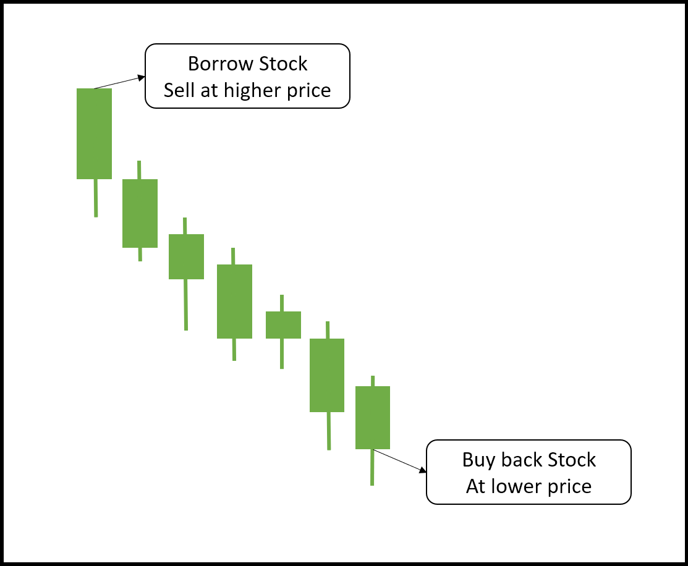
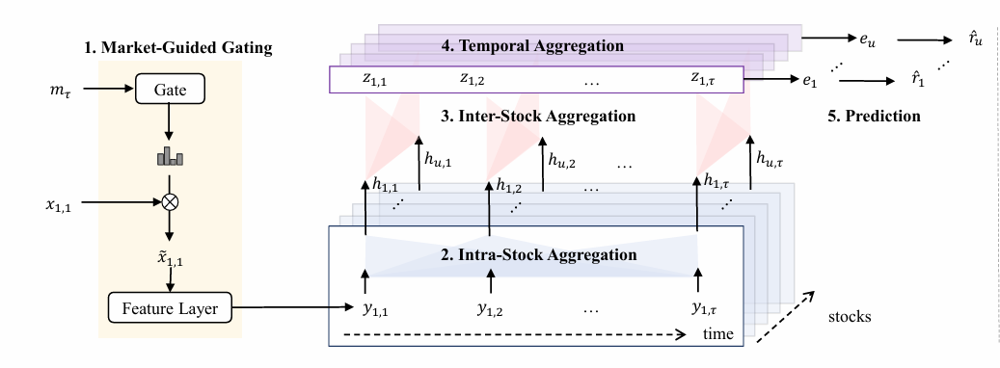

<!-- _paginate: tfalse -->

##   DLP Final Project Prposal: Market Guided Stock Transformer 
Group 7
10705009 陳重光、313551047 陳以瑄、313554043 戴明貴 

---
### Outline

* Intoduction - Market Guided
* MASTER - AAAI'24
* Motivation & Innovation
* Problem Definition

---
### Introduction - Market Guided
Stock prediction features can be divided into two types:
1. Individual Stock Features: 
    * Open price, close price, etc.
    * Trading volume
2. Shared market features:
    * Market index
    * Macroeconomic indicators, e.g. interest rate

---

### Introduction - Market Guided
The market feature impacts the effectiveness of other features.

**Example: Short Selling**
When investors believe a stock is overvalued.
1. Borrow stock, sell at high price.
2. Buy back at lower price when it falls.
3. Return to owner.

---
### Introduction - Market Guided
The market feature impacts the effectiveness of other features.

**Example: Short Selling**
Effectiveness in different market status:
* Bull Market: Short selling loses money, less concern.
* Bear Market: Short selling signals pessimism, more significant.

**→ Using market status to select relevant features.**

---
### MASTER:Market-Guided Stock Transformer for Stock Price Forecasting [1]

<!-- _footer: '[1] <a href="https://ojs.aaai.org/index.php/AAAI/article/view/27767">MASTER:Market-Guided Stock Transformer for Stock Price Forecasting -AAAI 24</a>' -->

---
### Limitation
Master: 想像得很完美，可是做的很簡陋
Market guided gating:
guide 的指標: only market index price & volume
被guide的feature: 只有各種window的price mean, stddev
=> 他的scalar 只是看說在哪個時間的股價是最重要的

---
### Idea 1
我們希望加入更多的guide 的指標:
圖

---
### Idea 2
經驗來說類股會有差，所以加入Famma12股票產業別

--- 
### Idea 3
先學上下游，篩選相關的新聞加入為feature

- **MASTER**: dynamic stock correlations with market-guided feature
- **FinDKG**: company relationships to identify business partners

Stock price forecasting methods face significant limitations in capturing the complete financial ecosystem:

**Isolated data sources**: 

Models typically rely on either technical indicators or news events
- Supply chain relationships between companies
- Cross-company news undetected influence 
- Industry-wide effects
**→ approach incorporating cross-company dynamics**
---
### Innovation

- **MASTER**: dynamic stock correlations with market-guided feature
- **FinDKG**: company relationships to identify business partners
---
### Problem Definition
Given a set of stocks $S$ with features $x_{u,t} \in \mathbb{R}^F$ collected at time steps $t \in [1, \tau]$:

For each stock, we consider:
- Individual stock features (price, volume)
- Shared market features(market index, macroeconomic indicators)
- Industry-Level feature (return)
- News-derived features (公司自己的，關聯企業的)

Output: The normalized return ratio $r_u = \text{Norm}_S((c_{u,\tau+d} - c_{u,\tau+1})/c_{u,\tau+1})$ is prediction target.

---
### Data Description

The dataset for input of this study consists of the following data:
  - **Stock prices**
  - **Industry**
  - **Market index**
  - **Economic indicator**
  - **Sentimental scores**

---
### Data Description (cont.)
- **Stock Price**:
Using the S&P 500 constituents as our base, we classify stocks into 12 categories following the Fama-French industry classification [3].

  From each category, 8 companies are selected based on market capitalization, resulting in a total of 96 firms. 
  
  For each selected company, we collect daily stock data, including open, high, low, and close prices and trading volume.

---
### Data Description (cont.)
- **Industry**:
The industry returns are derived from the Fama-French 12 industry classification dataset.
- **Market Index**: 
S&P 500 market index

- **Economic Indicators**:
We use interest as our economic indicator.

- **Sentimental Scores**:
Daily news sentiment from RavenPack [4] is used to measure its impact on the market and stocks.

---
### Data Description (cont.)
|NAME|NUMBER|TRAINING|TEST|SOURCE|
|:-:|:-:|--|--|:-:|
|Stock Price|96 * 5|2010 - 2022|2023|WRDS - CRSP|
|Industry|12|2010 - 2022|2023|Fama-French|
|Market Index|1|2010 - 2022|2023|CRSP|
|Economic Indicators|1|2010 - 2022|2023|VIX|
|Sentimental Scores|6|2010 - 2022|2023|Ravenpack|

---
### Expected result
因為換了股票(中國=>美股)，所以related work的無法參考
但是我們希望比較有無gate的差別。

---
### Example of footer
MASTER:Market-Guided Stock Transformer for Stock Price Forecasting [1]

<!-- _footer: '[1] <a href="https://ojs.aaai.org/index.php/AAAI/article/view/27767">MASTER:Market-Guided Stock Transformer for Stock Price Forecasting</a>' -->

---
### Example of table
|OFTIC|ACTDATS|ESTIMID|ALYSNAM|HORIZON|VALUE|ESTCUR|
|--|--|--|--|--|--|--|
|GOOGL|2015-10-23|GOLDMAN|BELLINI, CFA H|12|42.50|USD|
|2330|2014-10-21|CSCFH|CHEN L| 3|140.000|TWD|

---
### Example of insert images

---
### References

[1] Li, T., Liu, Z., Shen, Y., Wang, X., Chen, H., & Huang, S. (2024). MASTER: Market-Guided Stock Transformer for Stock Price Forecasting. In Proceedings of the AAAI Conference on Artificial Intelligence, 38(1), 162-170.

[2] Xie, J., Zhang, Y., Gong, X., Huang, J., Li, Z., Qin, B., & Liu, T. (2023). CausalStock: Deep End-to-end Causal Discovery for News-driven Stock Movement Prediction. In Proceedings of the 46th International ACM SIGIR Conference on Research and Development in Information Retrieval (SIGIR '23) (pp. 2320-2329). ACM.

