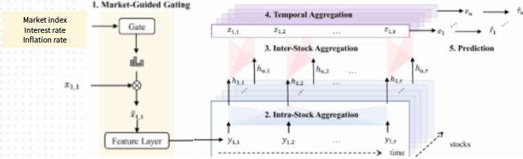

<!-- _paginate: tfalse -->

##   DLP Final Project Prposal: Market Guided Stock Transformer 
Group 7
110705009 陳重光、313551047 陳以瑄、313554043 戴明貴 

---
### Outline

* Intoduction - Market Guided
* MASTER - AAAI'24
* Method
* Dataset
* Expected Result

---
### Introduction - Market Guided
Stock prediction features can be divided into two types:
1. Individual Stock Features: 
    * Open price, close price, etc.
    * Trading volume
2. Shared Market Features:
    * Market index
    * Macroeconomic indicators, e.g. interest rate

---

### Introduction - Market Guided
The market feature impacts the effectiveness of other features.

**Example: Short Selling**
When investors believe a stock is overvalued.
1. Borrow stock, sell at high price.
2. Buy back at lower price when it falls.
3. Return to owner.

Short selling interest: the amount of stocks being short.

---
### Introduction - Market Guided
The market feature impacts the effectiveness of other features.

**Example: Short Selling**
Effectiveness in different market status:
* Bull Market: short selling loses money, less concern.
* Bear Market: short selling signals pessimism, more significant.

**→ Using market status to select relevant features.**

---
### MASTER:Market-Guided Stock Transformer for Stock Price Forecasting [1]

---
### Limitation
Simple Representation of Market Status:
Only market index prices and trading volumes are used as inputs.

Improvements: Expanding Shared Market Features
1. Macroeconomic features
2. Industry-level features
3. News-based features

<!-- ### Limitation

 Restricted Guiding Indicators ( \( m_t \) )

- Only market index prices and trading volumes are used as guiding indicators, failing to capture diverse market signals.

Limited Guided Features ( \( x_{1,1} \) )

- Only statistical features based on prices are guided, lacking rich market context information.

Simplistic Scalar Attention

- Importance is assigned only to temporal points, without modeling complex feature interactions. -->

---
### Idea 1
Market-guided indicators expansion for richer market dynamics

---
### Idea 2
Industry-level features for sector-specific behavior capture

--- 
### Idea 3
Supply chain and news features for enhanced forecasting

- **MASTER**: dynamic stock correlations with market-guided feature
- **FinDKG**: company relationships to identify business partners[2]

Stock price forecasting methods face significant limitations in capturing the complete financial ecosystem:

**Isolated data sources**: 

Models typically rely on either technical indicators or news events
- Supply chain relationships between companies
- Cross-company news undetected influence 
- Industry-wide effects
**→ approach incorporating cross-company dynamics**
<!-- ### Innovation

- **MASTER**: dynamic stock correlations with market-guided feature
- **FinDKG**: company relationships to identify business partners -->
---
### Problem Definition
Given a set of stocks $S$ with features $x_{u,t} \in \mathbb{R}^F$ collected at time steps $t \in [1, \tau]$:

For each stock, we consider:
- Individual stock features (price, volume)
- Shared market features(market index, macroeconomic indicators)
- Industry-Level feature (return)
- News-derived features (company and related party)

Output: The return ratio $r_u = \text{Norm}_S((c_{u,\tau+d} - c_{u,\tau+1})/c_{u,\tau+1})$

---
### Data Description

The dataset for input of this study consists of the following data:
  - **Stock prices**
  - **Industry**
  - **Market index**
  - **Economic indicator**
  - **Sentimental scores**

---
### Data Description (cont.)
- **Stock Price**:
  * **Base**: S&P 500 constituents
  * **Industry classification**: base on the Fama-French 12 industry [3].
  * **Number of stocks**: 8 firms * 12 industries = 96 firms
  * **Stock feature (daily)**:
    1. price: open, high, low, close prices
    2. volume: trading volume
    3. others: short selling interest, etc.

---
### Data Description (cont.)
- **Industry**:
The Fama-French 12 industry returns.
- **Market Index**: 
S&P 500 market index

- **Economic Indicators**:
VIX, interest rates, and other economic indicators

- **Sentimental Scores**:
News sentiment score from RavenPack

---
### Data Description (cont.)
|NAME|NUMBER|TRAINING|TEST|SOURCE|
|:-:|:-:|--|--|:-:|
|Stock Price|96 * 5|2010 - 2022|2023|WRDS - CRSP|
|Industry|12|2010 - 2022|2023|Fama-French|
|Market Index|1|2010 - 2022|2023|CRSP|
|Economic Indicators|1|2010 - 2022|2023|VIX, FRED|
|Sentimental Scores|6|2010 - 2022|2023|Ravenpack|

---
### Expected result

---

### Expected result (cont.)
The set of stocks has changed from Chinese stocks to U.S. stocks
 → Prior related works are no longer directly applicable.

We aim to compare performance between:
1. The original version of MASTER
2. MASTER with three improvements

---
### References

[1] Li, T., Liu, Z., Shen, Y., Wang, X., Chen, H., & Huang, S. (2024). MASTER: Market-Guided Stock Transformer for Stock Price Forecasting. In Proceedings of the AAAI Conference on Artificial Intelligence, 38(1), 162-170.

[2] Li, X. V., & Sanna Passino, F. (2024). FinDKG: Dynamic Knowledge Graphs with Large Language Models for Detecting Global Trends in Financial Markets. In Proceedings of the 5th ACM International Conference on AI in Finance (ICAIF '24) (pp. 573–581). 

--- 
### References (cont.)

[3] Fama, E. F., & French, K. R. (1997). Industry costs of equity. Journal of financial economics, 43(2), 153-193.

---
 
 
 
 

# Thank you for listening.

