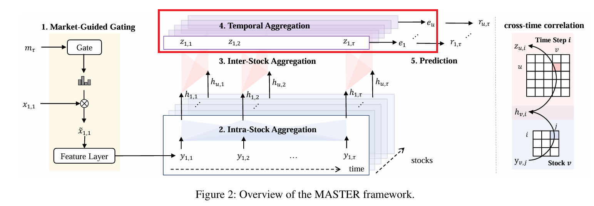
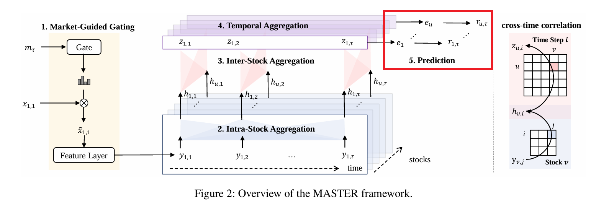

<!-- _paginate: tfalse -->

##    MASTER:Market-Guided Stock Transformer for Stock Price Forecasting
Tong Li, Zhaoyang Liu, Yanyan Shen, Xue Wang, Haokun Chen, Sen Huang
AAAI-24

---
### Related Work: Yoo et al., KDD-2021

---
### Problem
1. Overlook momentary and cross-time correlations between stocks

2. Ignore the impact of market status on feature effectiveness.
  Example: Volatility (risk) is more important in bear market.
---
### Method-Framework

---
### Method-Framework (cont.)

---
### Market-Guided Gating

---
### Market-Guided Gating
Given the market status vector $m_{\tau}$, 
learn the scale factor  $\alpha(m_{\tau}) = F \cdot \text{softmax}_{\beta}(W_{\alpha} m_{\tau} + b_{\alpha})$  
to rescale the stock features such that $\tilde{x}_{u,t} = \alpha(m_{\tau}) \circ x_{u,t}$

Market status vector $m_{\tau}$: 
1. Market index price (current value, historical mean, std dev)
2. Market index trading volume

Temperature $\beta$: The smaller the $\beta$, the stronger the gating effect.

##### It addresses limitation 1.

---
### Intra-Stock Aggregation

---
### Intra-Stock Aggregation
Single stock behavior is continuous → a simpler distribution

* Input Embedding: $y_{u,t} = f(\tilde{x}_{u,t}),　|y_{u,t}| = D$
* Sinusoidal Positional Encoding:  $p_t$, the order in the window
* Concatenate and Normalize:$Y_u = \big\|_{t \in [1,\tau]} \text{LN}(f(\tilde{x}_{u,t}) + p_t)$
* Multi-Head Attention:

  $Q^1_u=W^1_QY_u, \quad K^1_u = W^1_K Y_u, \quad V^1_u = W^1_V Y_u$
  
  $H^1_u = \text{FFN}^1(\text{MHA}^1(Q^1_u, K^1_u, V^1_u) + Y_u)$

---
### Inter-Stock Aggregation

---
### Inter-Stock Aggregation
A series of momentary stock correlation at each time step.

* Gather the local embedding along stock axis: $H^2_t = \big\|_{u \in S} h_{u,t}$
* Multi-Head Attention:
  $Q^2_t = W^2_Q H^2_t, \quad K^2_t = W^2_K H^2_t, \quad V^2_t = W^2_V H^2_t$
  $Z_t = \big\|_{u \in S} z_{u,t} = \text{FFN}^2 \left( \text{MHA}^2(Q^2_t, K^2_t, V^2_t) + H^2_t \right)$

##### It addresses Limitation 2 through the two steps above.
---
### Temporal Aggregation

---
### Temporal Aggregation
Summarize the obtained temporal embeddings.

Temporal attention layer along time axis:

$e_u = \sum_{t \in [1,\tau]} \lambda_{u,t} z_{u,t}$

where $\lambda_{u,t} = \frac{\exp(z_{u,t}^T W_\lambda z_{u,\tau})}{\sum_{i \in [1,\tau]} \exp(z_{u,i}^T W_\lambda z_{u,\tau})}$

---
### Prediction 

---
### Prediction 
Predict the stock return: $\hat{r}_u = g(e_u)$, $g(.)$ is a linear layer for regression.

$L=\sum_{u \in S}MSE(r_{u}, \hat{r}_{u})$, $r_{u}$ is the normalized return ratio in $d$ days, encoded with ranking information. 

---
### Experiments - Dataset
* **Stock sets:**  Chinese stock market CSI300 and CSI800
* **Time:** 2008 to 2022
  | | Time|
  |--|--|
  |Training|Q1 2008 to Q1 2020 |
  |Validation| Q2 2020|
  |Testing | Q3 2020 to Q4 2022|
* **Feature:**
  Individual stock feature: Alpha158 indicators
  Shared market feature: CSI300, CSI500 and CSI800 index

---
### Experiments - Evaluation Metrics
1. **Information Coefficient (IC)**
  
2. **Rank Information Coefficient (RankIC)**
  
3. **Information Ratio-based IC (ICIR)**
  
4. **Information Ratio-based RankIC (RankICIR)**
5. **Excess Annualized Return (AR)**
6. **Information Ratio (IR)**
  

---
### Experiments - Result

---
### Ablation Study - Beta

