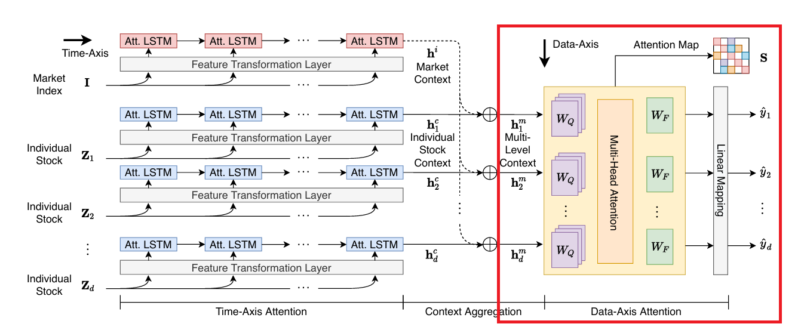
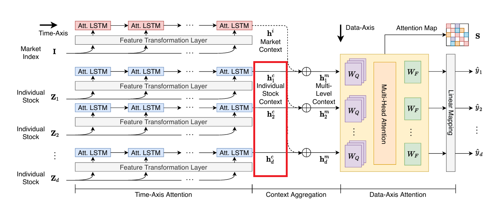

<!-- _paginate: tfalse -->

##   MASTER:Market-Guided Stock Transformer for Stock Price Forecasting[1]
Tong Li, Zhaoyang Liu, Yanyan Shen, Xue Wang, Haokun Chen, Sen Huang
AAAI-24
 
Presented by Group 7
110705009 陳重光、313551047 陳以瑄、313554043 戴明貴 

---
### Outline
* Introduction & Main Purpose
* Related Work - Yoo et al., KDD 2021
* Method
* Experienment & Ablation Study
* Conclusion

---
### Intro - Dynamic Stock Correlation Modeling
**Why Correlation Matters**
In stock prediction, not only individual histories matter, but also:
1. Cross-stock correlation
2. Market-stock correlation

**Types of Correlation Modeling**
1. Static correlation modeling
  Predefined rules, cannot capture real-time changes
2. Dynamic correlation modeling
  Transformer architecture, learns time-varying correlations

---
### Main Purpose
This study aims to model two phenomena:
1. Market status influence on feature relevance
2. Momentary and cross-time stock correlations

Both issues are limitations identified in Yoo et al. (KDD 2021).[2]

---
### Related Work – Yoo et al., KDD 2021
Accurate Multivariate Stock Movement Prediction via Data-Axis Transformer with Multi-Level Contexts

---
### Related Work (Cont.)
**Part 1: Time Axis Attention**
Single stock time series→ Attention LSTM→ Summarized embedding

---
### Related Work (Cont.)
**Part 2: Content Aggregation**
Incorporates market and stock representations:  $h^m_u = h^c_u + \beta h^i$

---
### Related Work (Cont.)
**Part 3: Data Axis Attention**
Uses Multihead attention to learn inter-stock correlation.

---
###  Limitation 1 - Market Status and Feature Selection
**Problem in Prior Work (Step 2):**
Integrates market information directly into stock representations.

---
###  Limitation 1 - Market Status and Feature Selection
**What Is Missed:** 
Market status influences which features are useful for prediction.

**Example:**
In bullish markets, investor optimism and capital inflow lead to:
• Broader investment across sectors
• Stronger cross-stock correlations
→ Features like peer stock movements become more relevant

---
###  Limitation 2 - Cross-time Stock Correlation
**Problem in Prior Work (Step 1 & 3):**
Uses overall stock representation to learn cross-stock correlation.

---
###  Limitation 2 - Cross-time Stock Correlation
**What Is Missed:**  
Stocks often respond to the same external factors at different times.
→ Correlation is not aligned in time but occurs across time steps.

**Example: Raw Material Shortage**

---
### Method-Framework

---
### Method-Framework (Cont.)

---
### Step1: Market-Guided Gating
**Idea:** adaptively select and scale features based on market conditions

---
### Market-Guided Gating
**Guiding Feature: Market status vector $m_{\tau}$**
* $|m_{\tau}| = F'$
* Market index price (current value, historical mean, std dev)
* Market index trading volume

**Guided Feature: Stock Features $x_{u,t}$**
* $|x_{u,t}| = F$
* Raw input features for stock u at time t

---
### Market-Guided Gating
**Gating Mechanism**
1. Learn the scale factor:  $\alpha(m_{\tau}) = F \cdot \text{softmax}_{\beta}(W_{\alpha} m_{\tau} + b_{\alpha})$  
    * α:  shared across all stocks $x_{u,t}$
    * β: smaller β → stronger filtering
2. Rescale each stock features: $\tilde{x}_{u,t} = \alpha(m_{\tau}) \circ x_{u,t}$

**Addresses limitation 1:**
Captures how market status influences the usefulness of features.

---
### Step2: Intra-Stock Aggregation
**Idea:** Single stock behavior is continuous → a simpler distribution

---
### Intra-Stock Aggregation
**Multi-Head Attention**
* Input: Rescaled features $\tilde{x}_{u,t}$
* Embedding: $y_{u,t} = f(\tilde{x}_{u,t}), |y_{u,t}| = D$
* Positional Encoding: Add sinusoidal $p_t$ to retain temporal order
* Sequence: $Y_u = \big\|_{t \in [1,\tau]} \text{LN}(f(\tilde{x}_{u,t}) + p_t)$

---
### Intra-Stock Aggregation
**Multi-Head Attention**
* Sequence: $Y_u = \big\|_{t \in [1,\tau]} \text{LN}(f(\tilde{x}_{u,t}) + p_t)$
* Attention

  $Q^1_u=W^1_QY_u$, $K^1_u = W^1_K Y_u$, $V^1_u = W^1_V Y_u$  

  $H^1_u = \text{FFN}^1(\text{MHA}^1(Q^1_u, K^1_u, V^1_u) + Y_u)$
* Output: Time-aware feature embeddings $h_{u,t}$ for each time step

---
### Step3: Inter-Stock Aggregation
**Idea:** Capture the momentary stock correlation at each time step.

---
### Inter-Stock Aggregation
**Multi-Head Attention**
* Input: Gather intra-stock embeddings: $H^2_t = \big\|_{u \in S} h_{u,t}$
* Attention:

  $Q^2_t = W^2_Q H^2_t$, $K^2_t = W^2_K H^2_t$, $V^2_t = W^2_V H^2_t$

  $Z_t = \big\|_{u \in S} z_{u,t} = \text{FFN}^2 \left( \text{MHA}^2(Q^2_t, K^2_t, V^2_t) + H^2_t \right)$

* Output: Temporal embedding $z_{u,t}$ for each stock

---
### Step 2+3: Inter-Stock & Intra-Stock Aggregations
**Addresses Limitation 2:**
Capture dynamic cross-stock correlations across time steps.

---
### Step 4: Temporal Aggregation
**Idea:** Summarize the obtained temporal embeddings.

---
### Temporal Aggregation
* Input: Temporal embedding $z_{u,t}$
* Temporal attention layer:
  * Use the latest temporal embedding $z_{u,\tau}$ as the query vector
  * Compute attention scores: $\lambda_{u,t} = \frac{\exp(z_{u,t}^T W_\lambda z_{u,\tau})}{\sum_{i \in [1,\tau]} \exp(z_{u,i}^T W_\lambda z_{u,\tau})}$
* Aggregate embeddings: $e_u = \sum_{t \in [1,\tau]} \lambda_{u,t} z_{u,t}$
---
### Step 5: Prediction 
**Idea:** Use the stock embedding to predict the stock price.

---
### Prediction 
* Predicted return: 
$\hat{r}_u = g(e_u)$, $g(.)$ is a linear layer for regression.

* Ground truth return: 
$r_{u}$ is the normalized return ratio

* Loss Function: $L=\sum_{u \in S}MSE(r_{u}, \hat{r}_{u})$

---

### Experiments - Dataset
* **Stock sets:**  Chinese stock market CSI300 and CSI800
* **Time:** 2008 to 2022
  | | Time|
  |--|--|
  |Training|Q1 2008 to Q1 2020 |
  |Validation| Q2 2020|
  |Testing | Q3 2020 to Q4 2022|
* **Feature:**
  Individual stock feature: Alpha158 indicators
  Shared market feature: CSI300, CSI500 and CSI800 index

---
### Evaluation Metrics
| Metric | Type| Description |
| -- | -- | -- |
| IC        | Ranking-based | Pearson correlation btw predictions and actual returns.|
| RankIC    | Ranking-based | Spearman rank correlation btw predictions and actual returns.|
| ICIR      | Ranking-based | Normalized IC (divided by std dev.)|
| RankICIR  | Ranking-based | Normalized RankIC|
| AR | Portfolio-based | Annualized excess return from investing in top-ranked stocks|
| IR   | Portfolio-based | Normalized AR|

For all metrics, higher values indicate better performance.

---
### Experiments - Result

---
### Ablation Study - Beta 
**Temperature β**
* A hyperparameter in the gating mechanism. 
* Small β → stronger gating effect → filter more features.

**Result:** X-axis: β; Y-axis: Performance Metric

---
### Ablation Study - Beta (Cont.) 
**Result:** X-axis: β; Y-axis: Performance Metric

* CSI300: easier dataset → most features are effective → larger β 
* CSI800: complex dataset → need feature selection → smaller β 

---
### Ablation Study - (N1, N2)
(N1, N2): The number of multi-heads in the attention mechanism.

**Findings:**
* Differences between head combinations are not significant.
* Most settings outperform the baseline → robustness

---
### Conclusion
**MASTER Key Features:**
1. Models realistic stock correlations.
2. Guides feature selection with market information.

**Experiments Result on the CSI300 and CSI800**
* improves 13% on ranking metrics
* improves 47% on portfolio-based metrics

---
### References

[1] Li, T., Liu, Z., Shen, Y., Wang, X., Chen, H., and Huang, S. (2024). MASTER: Market-Guided Stock Transformer for Stock Price Forecasting. In Proceedings of the AAAI Conference on Artificial Intelligence, 38(1), 162-170.

[2]Yoo, J., Soun, Y., Park, Y.-c., and Kang, U. (2021). Accurate multivariate stock movement prediction via data-axis transformer with multi-level contexts. In Proceedings of the 27th ACM SIGKDD Conference on Knowledge Discovery & Data Mining, 2037–2045.

---
 
 
 
 

# Thank you for listening.

