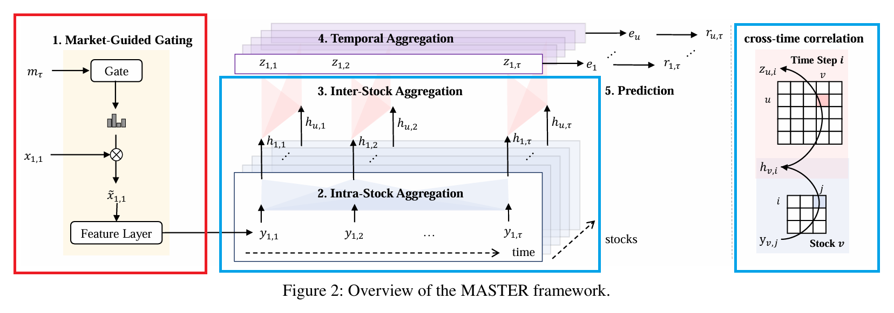
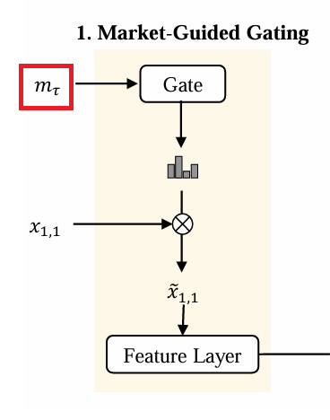
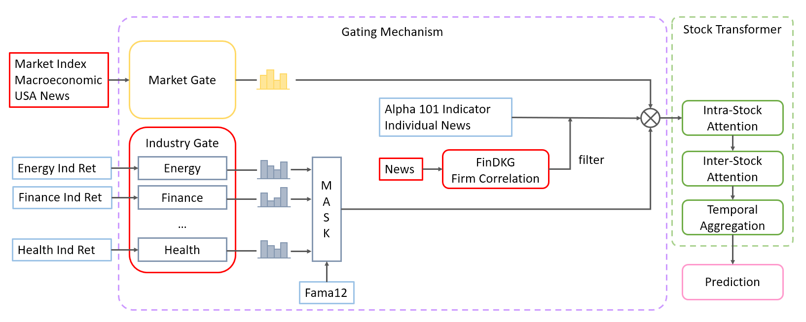
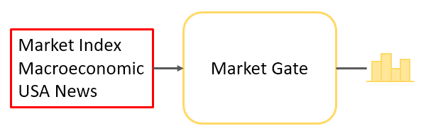
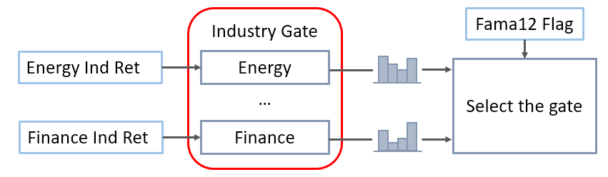
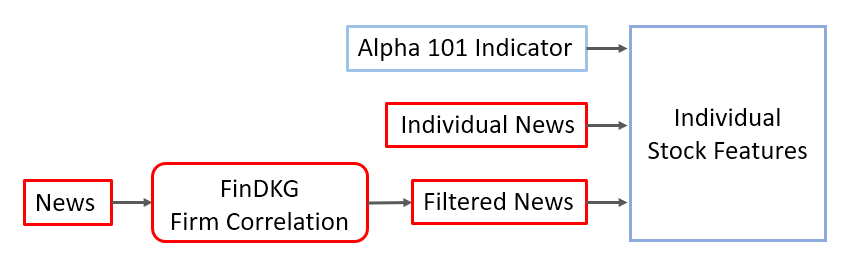

<!-- _paginate: tfalse -->

##   DLP Final Project: Enhanced Market Guided Stock Transformer 
Group 7
110705009 陳重光、313551047 陳以瑄、313554043 戴明貴 

---
### Reference Work - MASTER
1. Dual-layer Attention:  Learning cross-time stock correlation
2. Market-Guided Gate: Use market status to select relevant features

---

### Limitation

**Guiding Features**
Only market index prices and volumes

**Key Concern**
Insufficient market status info
→ Gating fails to distinguish markets
→ Poor feature rescaling
→ Lower prediction performance

---
### Improvement
(1) Expand Market Features (2) Industry Gate (3) News Features

---

### Trick 1 - Expand Market Features 
**Illustration**

**Guiding Features**
|Feature Type | Source | Description|
| -- | -- | -- |
| S&P 500 Price & Volume  | Yahoo Finance | Mean and std dev over 5, 10, 20, 30, and 60 days |
| Macroeconomic Indicators | FRED | Oil prices, bond data (3M T-Bill, yield spread, etc.) |
| U.S. Macro News | RavenPack | News filtered by entity = "US" |

---
### Trick 2 - Industry Gate
**Illustration**

* Data Source: Fama-French 12 Industries
* Filter out Others and industries < 8 stocks (Durables and Telecom)
* Each industry has its own gate → 9 gates in total
* Guiding Feature:
  Mean and std dev of industry returns over 5, 10, 20, 30, 60 days

---
### Trick 3 - News-Based Features
**Illustration**

1. Use FinDKG to identify firms correlated with the target stock
2. Filter news scores from RavenPack related to the correlated firms
3. Incorporate the filtered news scores as additional features 

※ CausalStock shows news has a great impact on the ACL18 dataset, which contains the top 8 firms per industry.

---
### Experiment Setting
**Stock numbers:** 8 firms × 9 industries = 72 stocks

**Comparisons:**
1. Original MASTER
2. Trick 1 – Expanded Market Features
3. Trick 2 – Industry Gate
4. Trick 3 – Added News Features
5. All Tricks Combined

---
### Experiment Setting (Cont.)
**Hyperparameters:**
* Training epochs: 20
* Intra-stock attention heads: 4
* Inter-stock attention heads: 2
* Dropout rate: 0.1
* Feature dimension: 128
* Beta (gating strength):  varies based on number of raw features

---
### Experiment Setting (Cont.)
**Dataset Split**
1. Follow MASTER Paper - Full period
    * Training: 2008 to 2022
    * Testing: 2023
2. Pre-COVID-19 period:
    * Training: 2008 to 2017
    * Testing: 2018
---

### Result
1. Follow MASTER Paper - Full period

| Metric | No Trick | All Tricks | Trick 1 | Trick 2 | Trick 3 |
| -- | -- | -- | -- | -- | -- |
| RMSE   | 0.0196   | **0.0184**| 0.0186  | 0.0196  | 0.0185  |
| MAE| 0.0143 |**0.0130** | 0.0134 | 0.0142 | 0.0131 |

 
2. Pre-COVID-19 period:

| Metric | No Trick | All Tricks | Trick 1 | Trick 2 | Trick 3 |
| --| -- | --| -- | -- | -- |
| RMSE   | 0.0180   | **0.0168** | 0.0169  | 0.0174  | 0.0175  |
| MAE| 0.0129 | **0.0120** | 0.0122 | 0.0125 | 0.0126 |

---
### Discussion
**Trick 1 – Market Gate**
* Most stable and effective (5–6% rmse drop in both 2018 & 2023)
* Extra macro features help gating

**Trick 2 – Industry Gate**
* Slight improvement, only works in 2018.
* Too few stocks per industry for stable industry-specific learning.

---
### Discussion (Cont.)
**Trick 3 – News Features**
* Greater impacts in 2023 (improvement of 5.6 vs 2.8)
* News might helps model detect recovery.

**All Tricks**
* No further boost
* Trick 1 & Trick 3 may overlap (both have news features)
* Multiple gates may interfere, weakening the overall effect

---
### Ablation Study - Industry Beta
**Temperature Beta**
* A hyperparameter in the gating mechanism. 
* Small Beta → stronger gating effect → filter more features.

**Setting**
* Period: Pre-COVID (Task 2)
* Market Gate Beta = 2 (fixed)
* Industry Gate Beta = [2, 4, 6, 8]

---

### Ablation Study (Cont.)
**Result**
|  | No ind gate | Ind beta = 2 | Ind beta =  4 |Ind beta =  6 | Ind beta = 8|
| ------------ | -------- | ------ | ------ | ------ | ------ |
| **RMSE**     | 0.0180   | 0.0182 | 0.0178 | **0.0174** | 0.0177 |

**Discussion**
* If two gates have same gating strength → may conflict
* Best result at industry beta = 6 
  → suggests the market gate plays a more critical role.

---
### Conclusion
1. MASTER generalizes well to U.S. stocks (original: China market).
2. Enriching market features improves gating effectiveness.
3. News features contribute more in the post-pandemic market.

